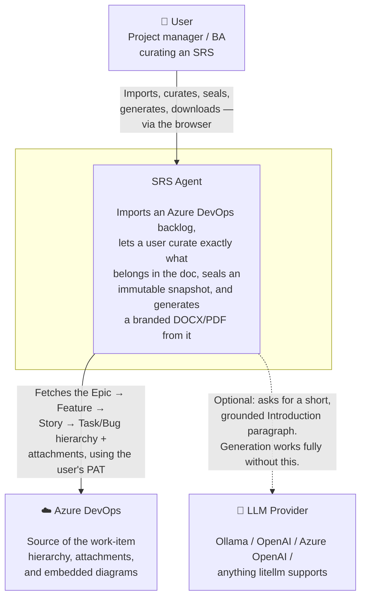
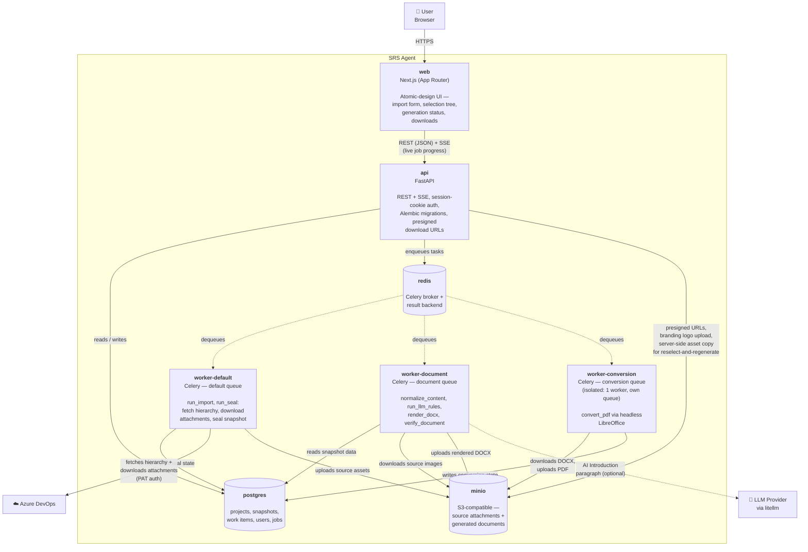

# Architecture

C4-style Context and Container diagrams for SRS Agent, plus a precise answer to "what does the LLM actually do" — it's used in exactly one place, for one narrow purpose, and is never required for the app to function.

## System Context

Who/what interacts with SRS Agent, and why.

## Containers

The deployable units inside the system boundary, and how they talk to each other. Matches `docker-compose.yml` one-to-one.

A few things this diagram intentionally shows that are easy to miss reading the code cold:

- **Three separate Celery workers, not one** — `convert_pdf` is pinned to its own single-concurrency `conversion` queue specifically so a hung or heavy LibreOffice process can never starve the `import`/`render` pipelines (see `apps/worker/src/celery_app.py`'s `task_routes`).
- **"Reselect & regenerate" never touches Azure DevOps or Celery at all** — forking a new snapshot from an already-sealed one (`POST /snapshots/{id}/branch`) runs synchronously inside the `api` container itself: it copies rows in Postgres and does a server-side MinIO-to-MinIO object copy. No worker, no Azure API call, no re-download — that's the whole point of the feature.
- **The dotted lines to the LLM Provider are deliberately optional** — see below.

## What the LLM actually does

Exactly one thing, in exactly one place: `apps/worker/src/tasks/generate_pipeline.py::run_llm_rules`, running on `worker-document`.

- **Input**: the titles + a short snippet of description (and any custom fields like Business Rules / Functional Requirements) from up to `MAX_EPICS_IN_LLM_PROMPT` Epics in the sealed selection.
- **Output**: a 2-3 paragraph Introduction section for the generated document — prose only, no markdown, explicitly instructed not to invent anything not implied by the Epics it was given.
- **Everything else in the document is `SOURCE_EXTRACTED`, verbatim, always** — titles, IDs, states, descriptions, acceptance criteria, tables, diagrams. The LLM never touches any of that; it only ever writes the one narrative paragraph, and even that is clearly attributable to being AI-generated rather than pulled from Azure DevOps.
- **It's entirely optional.** If `MODEL_NAME` isn't set, `get_default_adapter()` returns `None` and `run_llm_rules` returns immediately — the Introduction just uses a deterministic default instead. If the provider is unreachable, slow, or errors, the task catches it, logs a warning, and generation continues exactly the same way. An LLM failure has never once failed a document generation by design — see the task's own docstring for the "controlled enhancement, never a dependency" reasoning.
- **Provider-neutral** — routed through [litellm](https://github.com/BerriAI/litellm), so `MODEL_NAME`'s prefix (`ollama/...`, `gpt-4o`, `azure/...`) selects the backend; `OLLAMA_BASE_URL` only matters for the `ollama/` case.
